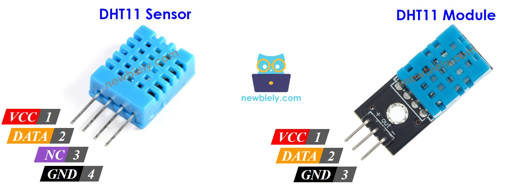

# 🌡️ | DHT11

<kbd>
  

  

    Pinagem DHT11
  

</kbd>

---

## 💻 | Saida em terminal

  

  
--- 
## ▶️ | Principais características

- Mede: Temperatura (0–50 °C) e umidade (20–90% UR)
- Precisão: ±2 °C (temperatura), ±5% UR (umidade)
- Tensão de operação: 3V a 5.5V
- Pontos fortes: Simples, barato e fácil de usar
- Limitação: Menor precisão e faixa limitada comparado ao DHT22
- [Referência](https://www.adafruit.com/product/386)
