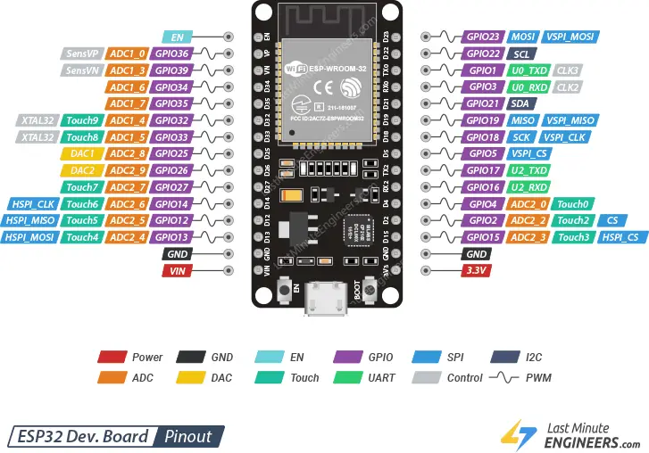

# 🎛️ | ESP32

<kbd>
  

  

    Pinagem ESP32
  

</kbd>

---

## ▶️ | Principais características

- Processador: Dual-core, até 240 MHz
- Memória: ~520 KB SRAM + suporte a Flash externa
- Conectividade: Wi-Fi + Bluetooth (BLE e Clássico) integrados
- Interfaces: GPIOs multifuncionais, UART, SPI, I2C, PWM, ADC, DAC
- [Referência](https://pt.wikipedia.org/wiki/ESP32)
