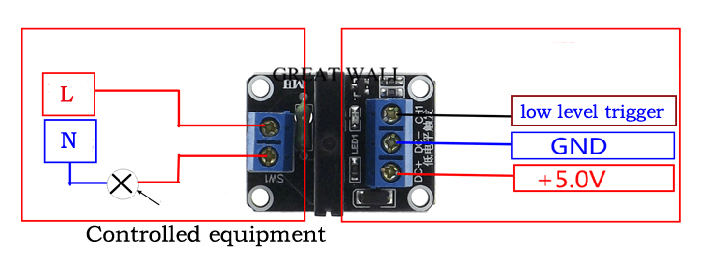

# 🗝️⚡ | G3MB-202P

<kbd>
  

  

    Pinagem G3MB-202P
  

</kbd>

## ▶️ | Principais características

- Tensão de operação: 5V DC
- Tensão do sinal de controle de entrada: 0V – 0.5V Low stage (SSR está desligado), 0.5V – 2.5V (estado desconhecido), 2.5 – 20V High state (SSR está ligado)
- Faixa de tensão de carga: 75 - 264V AC (50/60Hz)
- Corrente de carga: 0.1 - 2A
- [Referência](https://cb-electronics.com/products/g3mb-202p/)
