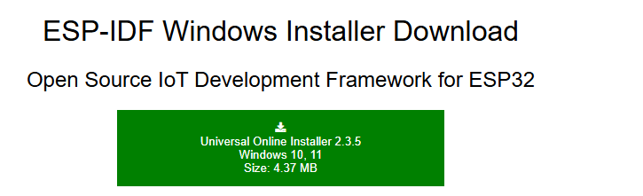

# 📃 | Ambientação

Para a ambientação do projeto foi utilizado o Visual Studio Code (VSCode) junto a extensão da Espressif disponibilizada no mesmo. Já que a programação da plataforma ESPRainMaker recebe mais suporte via ESP-IDF que, por sua vez, tem ambientação nativa no VSCode via extensão. Com isso, segue a instalação e configuração das ferramentas utilizadas:

  ## Observações:
  
  - ir colocando mais coisa aq
  - As ferramentas foram utilizadas no sistema operacional Windows, mais especificamente no Windows 11 nas versões disponíveis entre os meses de Março e Junho de 2025;
  - Nenhum dos diretórios deve ter caracteres especiais;
  - Os itens necessários para o funcionamento integral das ferramentas devem intrinsicamente instalados/colocados nas pastas indicadas;
    
  Desse modo, o funcionamento do projeto é garantido tendo em vista as restrições acima em vigência no periodo de desenvolvimento citado
  

## 0. Instalação do ESP-IDF 

  Primeiramente, é necessário baixar o ESP-IDF que deve ser feito acessando o link : (https://dl.espressif.com/dl/esp-idf/). Utilizar preferencialmente o instalador online.
 

  

  
  Na instalação, selecione o diretorio de instalação como o seu  "DISCO LOCAL C". O resultado esperado é a pasta "Espressif" aparecer junto a outras como: "Arquivo Programas" ,"Arquivo Programas(x86)" e etc.
  
## 1. Instalar o VSCode 

  A instalação da IDE não segue um criterio especifico para o seu funcionamento posteriormente. Assim, você pode simplesmente baixar pelo site: (https://code.visualstudio.com) a IDE e depois instalar onde achar oportuno.
  
https://www.arduino.cc/en/software/

## 2. Instalação da extensão na IDE 

Na aba "Extensions" do VSCode, procurar por "ESP-IDF" e instalar.

  

---------------------------------------------------------------------------------------------

## 2. Instalar a 'Board' do ESP32
Pesquise por "**esp32**" e instale em Tools > Board > Board Manager

## 3. Selecionar a 'Board'
Tools > Board > esp32 > "ESP32 Dev Module"

## 4. Selecionar o 'Partition Scheme'
Tools > Partition Scheme > RainMaker 4MB No OTA

## 5. Selecionar a 'Port'
Selecione a 'port' por onde o ESP32 está conectado em Tools > Port 

## 6. Possíveis erros
Certifique-se de que o Windows ou seu sistema operacional reconhece a porta conectada do ESP32 (mais informações em https://www.reddit.com/r/esp32/comments/11pmedy/issue_uploading_to_esp32/)
