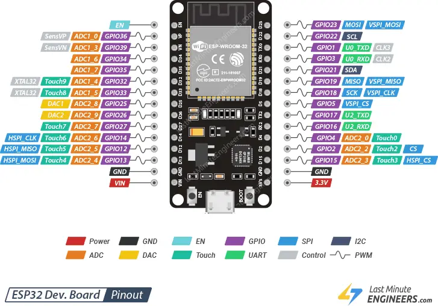

# 📃 | Ambientação

Para a ambientação do projeto foi utilizado o Visual Studio Code (VSCode) junto a extensão da Espressif disponibilizada no mesmo. Já que a programação da plataforma ESPRainMaker recebe mais suporte via ESP-IDF que, por sua vez, tem ambientação nativa no VSCode via extensão. Com isso, segue a instalação e configuração das ferramentas utilizadas:

  ## Observações:
  
  - ir colocando mais coisa aq
  - O projeto foi desenvolvido no sistema operacional Windows, mais especificamente no Windows 11 nas versões disponíveis entre os meses de Março e Junho de 2025;

  Desse modo, o funcionamento do projeto foi concedido com restrições vistas acima em vigência no periodo de desenvolvimento citado
  


# 0. Instalação do ESP-IDF 

  Primeiramente, é necessário baixar o ESP-IDF que deve ser feito acessando o link : (https://dl.espressif.com/dl/esp-idf/). 


  <kbd>
  
</p>
  <p align = center>
    Pinagem ESP32
  </p>
</kbd>


  Utilizar preferencialmente o instalador online

## 0. Instalar a Arduino IDE
https://www.arduino.cc/en/software/

## 1. Adicionar a 'Board' do ESP32
Cole ```https://raw.githubusercontent.com/espressif/arduino-esp32/gh-pages/package_esp32_index.json``` em File > Preferences > Additional boards manager URLs

## 2. Instalar a 'Board' do ESP32
Pesquise por "**esp32**" e instale em Tools > Board > Board Manager

## 3. Selecionar a 'Board'
Tools > Board > esp32 > "ESP32 Dev Module"

## 4. Selecionar o 'Partition Scheme'
Tools > Partition Scheme > RainMaker 4MB No OTA

## 5. Selecionar a 'Port'
Selecione a 'port' por onde o ESP32 está conectado em Tools > Port 

## 6. Possíveis erros
Certifique-se de que o Windows ou seu sistema operacional reconhece a porta conectada do ESP32 (mais informações em https://www.reddit.com/r/esp32/comments/11pmedy/issue_uploading_to_esp32/)
