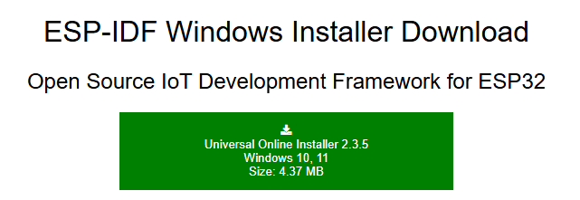
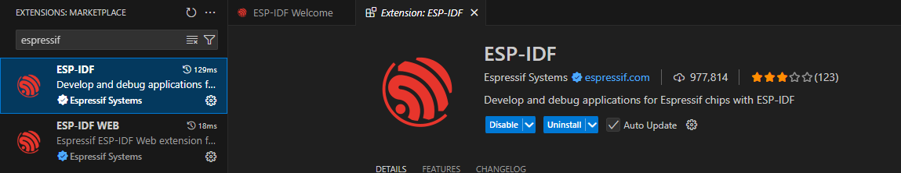
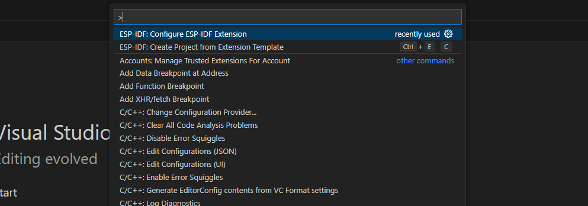
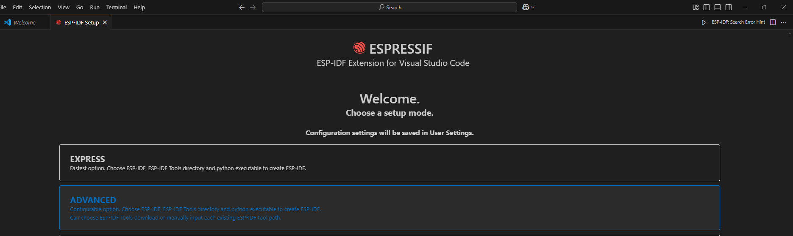
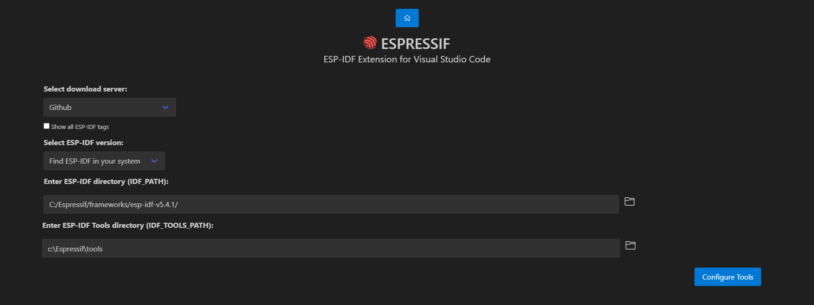
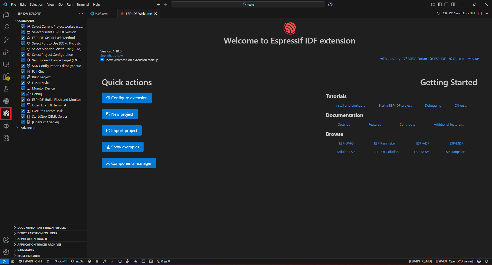
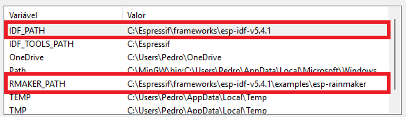

# 📃 | Ambientação

Para a ambientação do projeto, foram utilizados o Visual Studio Code (VSCode) junto à extensão da Espressif disponibilizada no VSCode, já que a programação da plataforma ESP RainMaker recebe mais suporte via ESP-IDF. Com isso, segue a instalação e configuração das ferramentas utilizadas:

---

## ⚠️ | Observações
  
- As ferramentas foram utilizadas no sistema operacional Windows (mais especificamente no Windows 11) nas versões disponíveis entre os meses de Março e Junho de 2025
- Nenhum dos diretórios deve ter caracteres especiais
- Os itens necessários para o funcionamento integral das ferramentas devem ser intrinsicamente instalados/colocados nas pastas indicadas

Desse modo, o funcionamento do projeto é garantido tendo em vista as restrições acima em vigência no período de desenvolvimento citado

---

## 0. Instalação do ESP-IDF 

https://dl.espressif.com/dl/esp-idf (utilizar preferencialmente o instalador online):
 

  

  
Na instalação, selecione como diretório de instalação o seu **Disco Local (C:)**

## 1. Instalar o VSCode 

https://code.visualstudio.com

## 2. Instalação da extensão no VSCode 

- Na aba **Extensions** do VSCode, procurar por **ESP-IDF** e instalar:

  

- Após a instalação, uma aba de configuração deve aparecer. Caso contrário, busque por '**> ESP-IDF: Configure ESP-IDF Extension**' na barra de pesquisa:

  

### ⚙️ | Na aba de configuração

- Selecione a opção **Advanced**:

  

- Agora, atribua a cada uma das opções os respectivos caminhos e clique em '**Configure Tools**':

  

- Após a configuração, sua IDE está pronta para utilizar as ferramentas de desenvolvimento padrão da Espressif no projeto:
    

  

  
### ❓ | Ajuda

Link em caso de dúvidas: https://github.com/espressif/vscode-esp-idf-extension/blob/master/README.md

### ⚠️ | Atenção aos próximos passos

Visando o amplo funcionamento do projeto, os arquivos disponibilizados para download foram configurados para buscar bibliotecas e itens importantes com base em variáveis de ambiente do sistema em seu computador. Sendo assim, qualquer descuido na configuração dessas variáveis e afins implica diretamente ao não funcionamento do projeto!
  
## 3. Configuração para desenvolvimento do ESPRainMaker

### 📁 | Alocação de pastas
  
- Cole a pasta do projeto deste repositório em '**C:\Espressif\frameworks\esp-idf-v5.4.1\examples**'

- Após, baixe a pasta ['lib_sensors'](https://github.com/enzoaccioly1/projeto-integrador-I/raw/main/source/lib_sensors) e descompacte-a em '**C:\Espressif\frameworks\esp-idf-v5.4.1\components**'

### 🧩 | Implementação das variáveis de ambiente

- Pesquise por 'Editar as variáveis de ambiente do sistema' na barra de pesquisa do Windows e acesse '**Variáveis de Ambiente**'
- Após, crie duas **variáveis de sistema** com os nomes **IDF_PATH** e **RMAKER_PATH** e adicione os seus diretórios correspondentes:

  

- Aplique as alterações e reinicie o computador

---

## ❌ | Possíveis erros

- A definir
