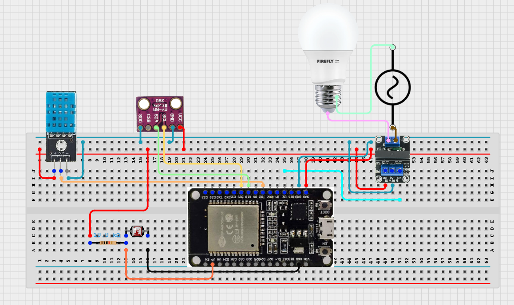
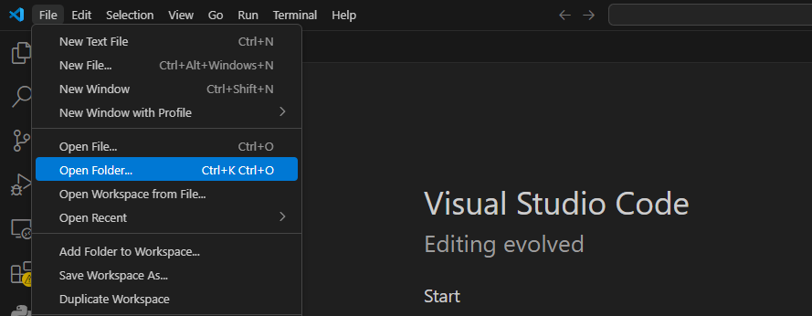
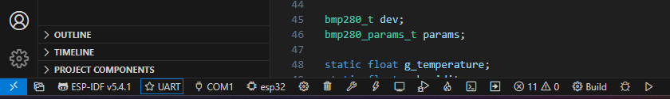
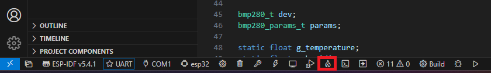
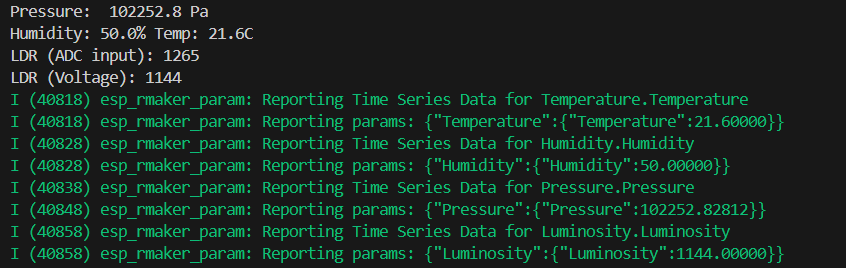
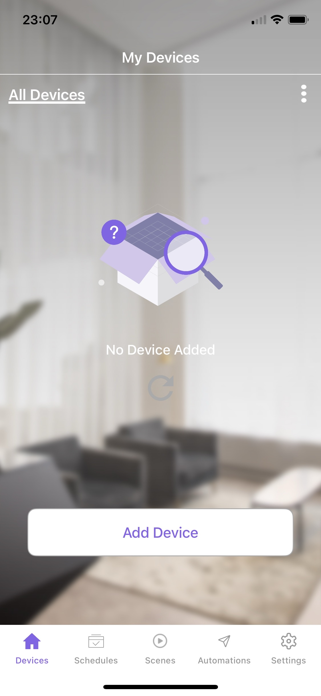

# 💻 | Manual de implementação

Para a implementação do projeto, foram utilizadas os seguintes conjuntos de ferramentas e configurações:

---

## 🔐 | Pré-requisitos (Hardware)

- Conjunto de hardware especificado no projeto (ESP32, sensores e relê)
- Chave Philips
- Fios

## Esquemático da montagem 

  

---

## 🔏 | Pré-requisitos (Software):
  
- Ter realizado o [tutorial de configuração da IDE](IDECONFIG.md)
- Cabo USB compatível com seu ESP32
- App (ESP RainMaker) instalado em seu celular

## 1. Gravar o software no microcontrolador

- Abrir a pasta do projeto 

 

  
  

- Ligue o ESP32 em seu computador utilizando o cabo USB
- Verifique os campos destacados na barra de configuração no canto inferior da IDE:

  

- Agora, selecione o método de flash como **UART**
- Selecione seu dispositivo **ESP32** e modelo corretamente
- Compile e grave na memória
 
Para isso, clique no símbolo abaixo e acompanhe esses processos via terminal na IDE:
    

  

Após a conclusão desse processo, você também poderá acompanhar a comunicação do sistema via terminal da seguinte forma:

  

## 2. Cadastro de dispositivos no ESP RainMaker

- Dentro do app, faça login e selecione '**Add Device**' (ou clique no '+' no canto superior direito):

  

- Escaneie o QR Code gerado no terminal do ESP-IDF ou, caso prefira conectar na rede Bluetooth (BLE), utilize a senha '12345678'

  

---

## ❌ | Possíveis erros:

- Caso o processo de gravação na memória persistir em 'Connecting...', pressione o botão de 'BOOT' do seu ESP32 por poucos segundos
- Caso a porta de comunicação do ESP32 não seja reconhecida, [clique aqui](https://www.silabs.com/developers/usb-to-uart-bridge-vcp-drivers?tab=downloads) e instale o driver da porta ([mais informações aqui](https://www.reddit.com/r/esp32/comments/11pmedy/issue_uploading_to_esp32))

