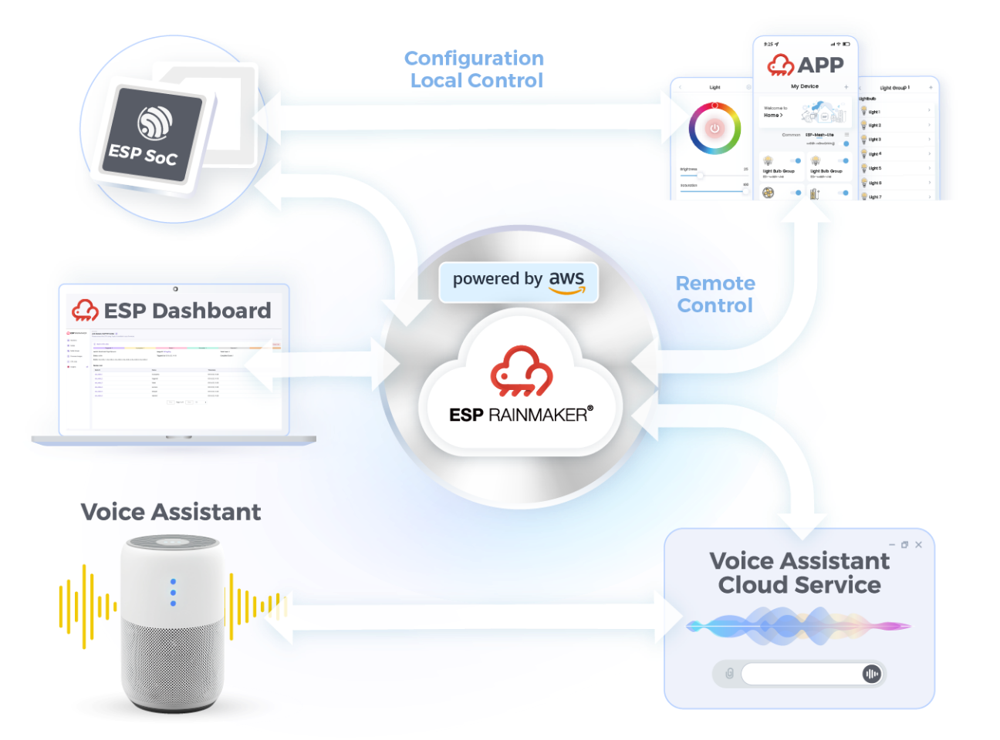
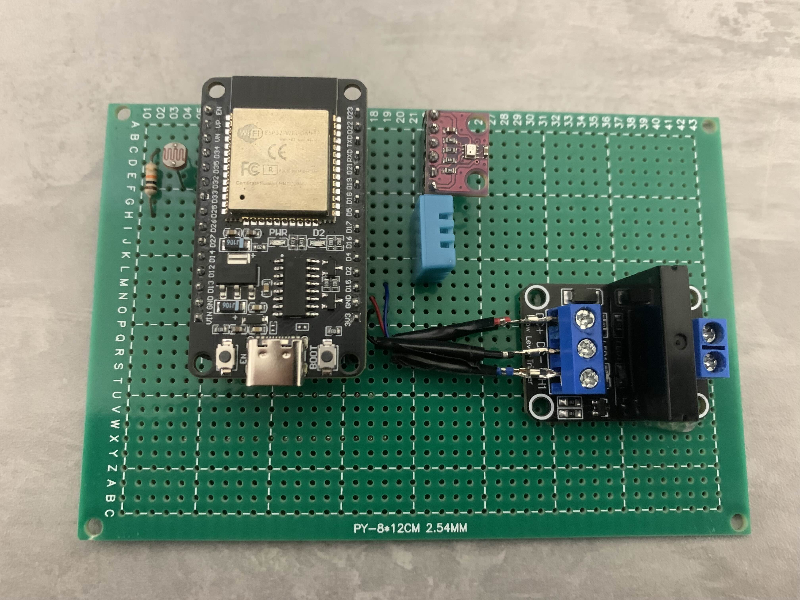

# Projeto Integrador I - _Sistema de automação doméstico_

O projeto se trata de um sistema de automação doméstico e tem como principal foco o envio e coleta de dados a partir de um **ESP32** e sensores, utilizando o sistema **ESP RainMaker** como meio de controle e monitoramento.

  

    
  

---

## 🛠️ | Componentes

- **ESP32**: um sistema-em-um-chip com microcontrolador integrado, Wi-Fi e Bluetooth
- **ESP RainMaker**: sistema IoT utilizado para monitoramento e controle de dados
- **Visual Studio Code (IDE)**: ambiente de desenvolvimento
- **Sensores**: DHT11, BMP280, LDR
- **Outro**: G3MB-202P (relé)

---

## 📖 | Documentação

### 🌐 | Plataforma:
- Sistema de comunicação e monitoramento: [ESP RainMaker](ESPRainMaker.md)
  
### ⚙️ | Hardware:
- Sensor de pressão e temperatura: [BMP280](BMP280.md)
- Sensor de umidade e temperatura: [DHT11](DHT11.md)
- Relé: [G3MB-202P](G3MB-202P.md)
- Sensor de luminosidade: [LDR](LDR.md)
- *System on a Chip*: [ESP32](ESP32.md)

### 💻 | Tutoriais:
- Configuração da IDE: [ESP-IDF no VSCode](IDECONFIG.md)
- Configuração e implementação geral: [Manual de Implementação](MANUAL.md)

---

## 🪛 | Protótipos

<kbd>
  

  

    Protótipo na Protoboard
  

</kbd>

<kbd>
  

  

    Protótipo na PCB Universal
  

</kbd>

---

## 📽️ | Apresentação Final

[Clique aqui](https://drive.google.com/file/d/1EHT3dIhuk52Il3clyIuTFqCIpXvBGXvd/view?usp=sharing)
