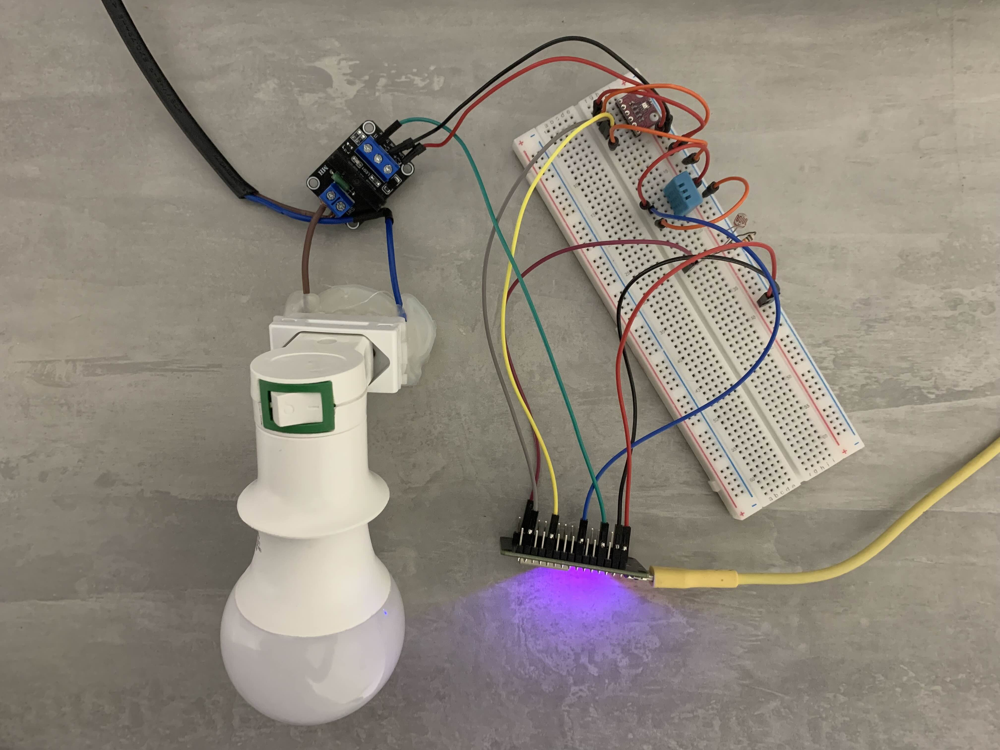

# Projeto Integrador I - _ESP32 com ESP Rainmaker_

O projeto tem como principal foco o envio e coleta de dados a partir de um **ESP32** e sensores, utilizando o sistema **ESP RainMaker** como meio de controle e monitoramento.

---

## 🛠️ | Componentes

- **ESP32**: um sistema-em-um-chip com microcontrolador integrado, Wi-Fi e Bluetooth
- **ESP RainMaker**: sistema IoT utilizado para monitoramento e controle de dados
- **Visual Studio Code (IDE)**: ambiente de desenvolvimento
- **Sensores**: DHT11, BMP280
- **Outro**: G3MB-202P (relé), LDR (light dependent resistor)

---

## 📖 | Documentação

- [ESP32](ESP32.md)
- [ESP-IDF (configuração)](IDECONFIG.md)
- [ESP RainMaker](ESPRainMaker.md)
- [Manual de Implementação](MANUAL.md)
- [BMP280](BMP280.md)
- [DHT11](DHT11.md)
- [G3MB-202P](G3MB-202P.md)
- [LDR](LDR.md)

## 🪛 | Protótipo 

  

