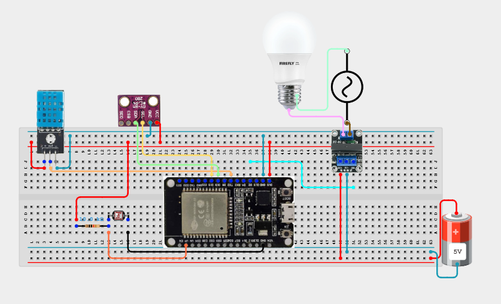
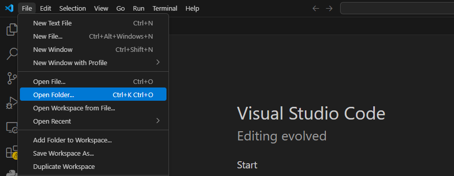
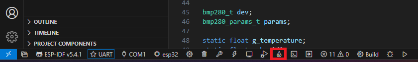

# 🔐 | Pré-requisitos (Hardware)

- Conjunto de hardware especificado no projeto (ESP32, sensores e relê)
- Chave Philips
- Fios
- Fonte de 5V

## Esquemático da montagem 

  

---

# 🔏 | Pré-requisitos (Software):
  
- Ter realizado o [tutorial de configuração da IDE](IDECONFIG.MD);
- Cabo micro-usb;
- App (ESPRainMaker) instalado no seu celular;

# 1. Gravar o software no microcontrolador

- Abrir a pasta do projeto 

 

  
  

- Ligue o esp com o seu computador usando o cabo micro-usb
  
- Verifique os campos destacados na barra de configuração no inferior da IDE:

  

  
  

  - Selecionar o método de flash como **UART**
    
  - Selecione o dispositivo **(ESP-32)**

  - Compilar e dar flash na memória
 
    Para isso, clique no simbolo abaixo de descrição **Build,flash e monitor** e acompanhe esses processos via terminal na IDE.
    
    

    
    

 
    *Note que quando for iniciado o flash no dispositivo será necessário pressionar o botão boot do seu Esp-32 por 2 segundos para permitir esse processo*
  
# 2. Anexar os dispostivos com o app

  
  -Entre o app

# n°. Possíveis erros:

- Nos testes feitos a IDE sempre reconheceu a porta do esp-32 no computador automaticamente, mas caso isso não ocorra, tente selecionar manualmente na barra de configuração ou acesse: colocar link do bizu

