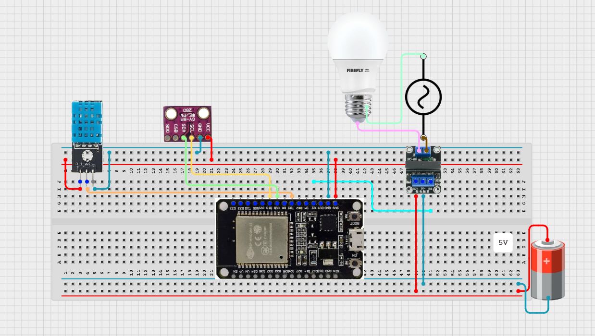

## acha um emoji ae | Pré-requisitos para a implementação do hardware:

- Conjunto de hardware especificado no projeto (ESP-32, sensores e rele);
- Chave Phillips;
- Fios;
- Fonte de 5v;

### Esquemático da montagem 

  

## :acha um emoji ae | Pré-requisitos para a implementação do software:
  
- Ter realizado o [tutorial de configuração da IDE](https://github.com/enzoaccioly1/projeto-integrador-I/blob/main/IDECONFIG.md?plain=1);
- Cabo micro-usb;
- App (ESPRainMaker) instalado no seu celular;

# 1. Gravar o software no microcontrolador

- Abrir a pasta do projeto 

pic

-Verifique os campos destacados na barra de configuração no inferior da IDE:

  

  
  

  - Selecione o dispositivo **(ESP-32)**

  - Selecionar o método de flash como **UART**

  - Compilar e dar flash na memória

  Para isso, clique no simbolo abaixo de descrição **Build,flash e monitor**
  

pic

Acompanhe o processo e se atente que, quando começar o processo de flash, deve-se segurar o botão **boot** do seu **Esp-32** por uns 2 segundos para permitir a gravação

# n°. Possíveis erros:

